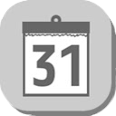

#  AtCoder-Google-Calender 

Add a contest schedule to your Google Calendar

## Description
The date and name of the contest will be automatically entered, and the link will be created that will allow you to transition to the point just before adding the google calendar.

## How to Install
1. Install [Tampermonkey](https://www.tampermonkey.net) on your browser(Chrome, Microsoft Edge, Safari, Opera Next, Firefox)

2. Install this script from [Greasy Fork](https://greasyfork.org/ja/scripts/390758-atcoder-googlecalender)

3. Finish!

or

1. Install from [chrome extension](https://chrome.google.com/webstore/detail/atcoder-calendar/dokfhaljgioiaeappgnmibgoipegbldf)
